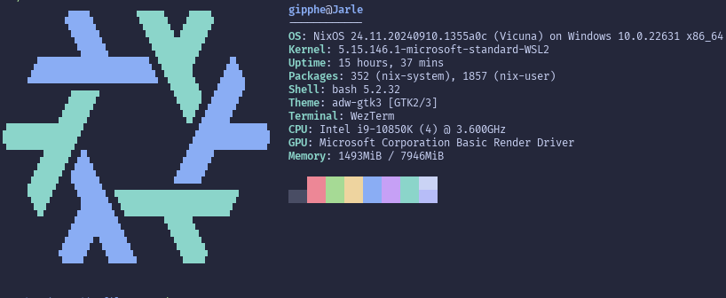
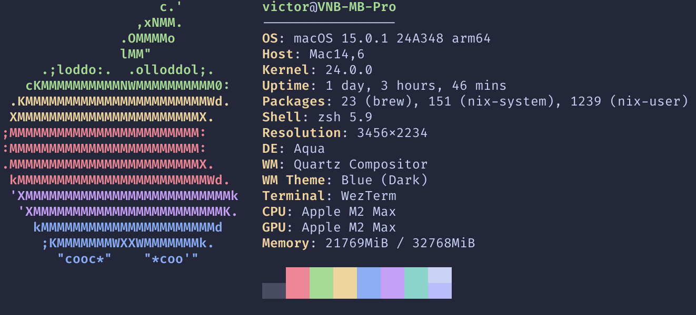
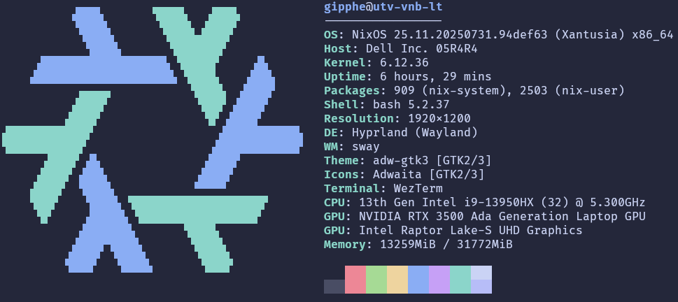

<table align="center" width="900px">
  <tr>
    <td align="center">
      
      <br>
      <h1>Gipphe's dotfiles</h1>
    </td>
  </tr>
  <tr>
    <td align="center">
      <a href="./LICENSE">
        
      <a href="https://nixos.org">
        
      </a>
    </td>
  </tr>
  <tr>
    <td align="center">
      <a href="https://catppuccin.com">
        
      </a>
    </td>
  </tr>
  <tr>
    <td align="center">
      Nix configuration for NixOS, nix-darwin, nix-on-droid and nixos-wsl.
    </td>
  </tr>
</table>

## Getting started

From NixOS:

```
nixos-rebuild switch --flake .#<hostname>
```

From MacOS and other non-NixOS Linux distros:

```
./install.sh
```

From Android's nix-on-droid:

```
nix-on-droid switch --flake .#<hostname>
```

## Machines

This dotfiles repo consists of configurations for NixOS, nix-darwin, and
nix-on-droid machines.

Machines are named according to elements from the periodic table, where
applicable.

Machine configs are located in [`./machines`](./machines).

### argon


NixOS in WSL on Windows. Supports GUI programs through WSLg.

Located in [`./machines/argon`](./machines/argon).



### silicon


_No longer in use, but kept as reference for future nix-darwin machines._

Corporate-issued Macbook Pro with nix-darwin.

Located in [`./machines/silicon`](./machines/silicon).



### cobalt


Lenovo Ideapad laptop running NixOS.

Located in [`./machines/cobalt`](./machines/cobalt).

### utv-vnb-lt


Corporate-issued Dell Precision 7680 running NixOS.

Located in [`./machines/utv-vnb-lt`](./machines/utv-vnb-lt).



### helium


_No longer in use._

Samsung Galaxy S21 Ultra running nix-on-droid on stock Android.

Located in [`./machines/helium`](./machines/helium).

### carbon


Google Pixel 9 Pro XL running nix-on-droid on GrapheneOS.

Located in [`./machines/carbon`](./machines/carbon).

## Architecture

To support NixOS, nix-darwin, nix-on-droid _and_ nixos-wsl, some choices have been made in
these dotfiles that might be of interest to others.

- Modules generally abstract over a feature.
- A module _must_ not cause any errors when enabled on systems that do not
  support it.
  - Modules are themselves responsible for not breaking in on unsupported
    systems.
- Modules are (mostly) enabled and configured through profiles.
- A profile can enable one or many modules.
- A machine configuration enables one or more profiles.
- A machine configuration may contain machine-specific configs, if necessary.
- Machine configurations are distinct based on the hostname of the machine.
- Each machine I have uses one and only one machine config each.

### Modules

- A module abstracts over a feature, whether it be a program or a set of
  settings.
- A module must have only 1 entrypoint, its `default.nix` file.
- Modules must be self-managing.
  - It is up to the module to ensure that its dependencies are in place.
  - It is up to the module to ensure the config as a whole is not invalid
    because of it.
  - Modules must account for being used in multiple different contexts: NixOS,
    nix-darwin, nixos-wsl, home-manager, etc.
- Modules should be toggleable. Listing a module in `imports` should not have
  any effect unless the module is explicitly toggled as well.
- Packages should be encapsulated in a separate module, as far as makes sense.
  Even simple packages with no extra configuration. This means the module is
  the smallest unit of abstraction in this dotfiles system.

All modules are located in [`./modules`](./modules), and are loosely grouped based on
their type.

### Profiles

- A profile can toggle and configure modules, nothing else.
- A profile may overlap with another profile.

All profiles are located in [`./profiles`](./profiles).

### Machine configuration

- A machine configuration is unique to a single machine.
- A machine configuration should only enable profiles.
- A machine configuration may include extra machine-specific options if
  necessary. Generally, this should be kept to a minimum, or preferrably
  avoided entirely.

## Legacy troubleshooting steps

### WSL

WSL-specific manual steps are required to enable `systemd`:

- Copy `wsl.conf` into `/etc/wsl.conf`:

  ```sh
  sudo cp wsl.conf /etc/wsl.conf
  ```

### Debian

Debian does not enable `systemd` correctly by default. The following steps are
required to enable it. These steps are taken from [this article].

#### User instance of systemd

- Check `systemd` status with `sudo service systemd-logind status`. You should
  get something along these lines:

  <!-- markdownlint-disable MD013 -->

  ```text
  systemd-logind.service - User Login Management
       Loaded: loaded (/lib/systemd/system/systemd-logind.service; static)
       Active: inactive (dead)
    Condition: start condition failed at Wed 2023-07-12 19:36:02 BST; 6min ago
               ├─ ConditionPathExists=|/lib/systemd/system/dbus.service was not met
               └─ ConditionPathExists=|/lib/systemd/system/dbus-broker.service was not met
         Docs: man:sd-login(3)
               man:systemd-logind.service(8)
               man:logind.conf(5)
               man:org.freedesktop.login1(5)

  Jul 12 19:36:02 UserName systemd[1]: systemd-logind.service - User Login Management was skipped because no trigger condi>
  ```

  <!-- markdownlint-enable MD013 -->

- Install `dbus-user-session`

  ```sh
  sudo apt install dbus-user-session
  ```

- Restart WSL VM with `wsl --shutdown` outside of WSL.
- Ensure `libpam-systemd` is up to date.

  ```sh
  sudo apt install --reinstall libpam-systemd
  ```

- Verify that it worked: `sudo service systemd-logind status`. You should see
  something along these lines:

  <!-- markdownlint-disable MD013 -->

  ```text
  systemd-logind.service - User Login Management
       Loaded: loaded (/lib/systemd/system/systemd-logind.service; static)
       Active: active (running) since Wed 2023-07-12 19:47:04 BST; 20s ago
         Docs: man:sd-login(3)
               man:systemd-logind.service(8)
               man:logind.conf(5)
               man:org.freedesktop.login1(5)
     Main PID: 130 (systemd-logind)
       Status: "Processing requests..."
        Tasks: 1 (limit: 16713)
       Memory: 1.8M
       CGroup: /system.slice/systemd-logind.service
               └─130 /lib/systemd/systemd-logind
  ```

  <!-- markdownlint-enable MD013 -->

#### Fix shutdown command

- Run `sudo apt-get install --reinstall dbus`
- Run `sudo systemctl start dbus`

#### VSCode WSL interop issue

- Run `echo ':WSLInterop:M::MZ::/init:PF' | sudo tee /usr/lib/binfmt.d/WSLInterop.conf`
- Run `sudo systemctl restart systemd-binfmt` and `sudo systemctl restart binfmt-support`
  - If either of those fail, run `sudo apt update && sudo apt install binfmt-support`
- Check

  ```sh
  $ sudo ls -Fal /proc/sys/fs/binfmt_misc
  total 0
  drwxr-xr-x 2 root root 0 Mar 24 11:11 ./
  dr-xr-xr-x 1 root root 0 Mar 24 11:11 ../
  -rw-r--r-- 1 root root 0 Mar 24 11:35 WSLInterop
  -rw-r--r-- 1 root root 0 Mar 24 11:35 jar
  -rw-r--r-- 1 root root 0 Mar 24 11:35 python3.11
  --w------- 1 root root 0 Mar 24 11:35 register
  -rw-r--r-- 1 root root 0 Mar 24 11:35 status

  $ sudo cat /proc/sys/fs/binfmt_misc/WSLInterop
  enabled
  interpreter /init
  flags: PF
  offset 0
  magic 4d5a
  ```

[this article]: https://avivarma1.medium.com/setting-up-debian-on-wsl2-with-systemd-fb4831dd7b82
