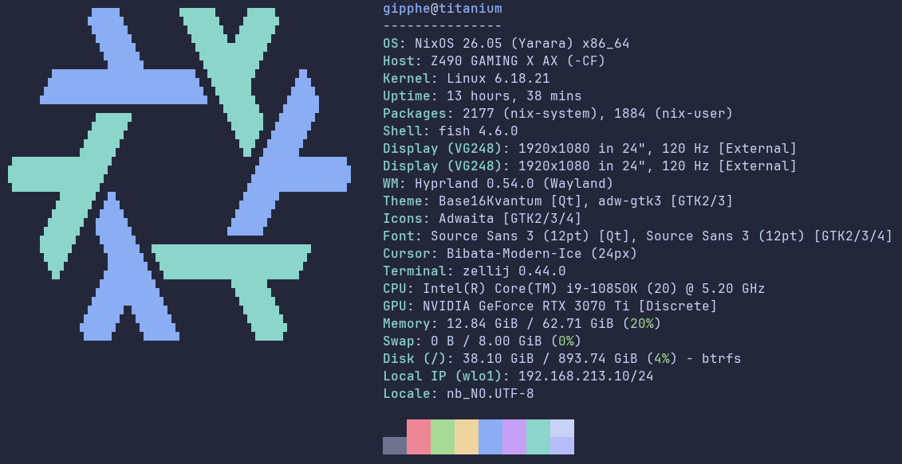

<table align="center" width="900px">
  <tr>
    <td align="center">
      
      <br>
      <h1>Gipphe's dotfiles</h1>
    </td>
  </tr>
  <tr>
    <td align="center">
      <a href="./LICENSE">
        
      <a href="https://nixos.org">
        
      </a>
    </td>
  </tr>
  <tr>
    <td align="center">
      <a href="https://catppuccin.com">
        
      </a>
    </td>
  </tr>
  <tr>
    <td align="center">
      Nix configuration for NixOS and nix-on-droid.
    </td>
  </tr>
</table>

## Getting started

From NixOS:

```
nixos-rebuild switch --flake .#<hostname>
```

From other non-NixOS Linux distros:

```
./install.sh
```

From Android's nix-on-droid:

```
nix-on-droid switch --flake .#<hostname>
```

## Machines

This dotfiles repo consists of configurations for NixOS, and nix-on-droid
machines.

Machines are named according to elements from the periodic table, where
applicable.

Machine configs are located in [`./machines`](./machines).

### titanium


NixOS on custom built desktop.

Located in [`./machines/titanium`](./machines/titanium).



### cobalt


Lenovo Ideapad laptop running NixOS.

Located in [`./machines/cobalt`](./machines/cobalt).

### carbon


Google Pixel 9 Pro XL running nix-on-droid on GrapheneOS.

Located in [`./machines/carbon`](./machines/carbon).

## Defunct machine configurations

_These machine configurations are no longer in use._

### helium


Samsung Galaxy S21 Ultra running nix-on-droid on stock Android.

Located in [`./machines/helium`](./machines/helium).

## Architecture

To support NixOS and nix-on-droid, some choices have been made in
these dotfiles that might be of interest to others.

- Modules generally abstract over a feature.
- A module _must_ not cause any errors when enabled on systems that do not
  support it.
  - Modules are themselves responsible for not breaking in on unsupported
    systems.
- Modules are (mostly) enabled and configured through profiles.
- A profile can enable one or many modules.
- A machine configuration enables one or more profiles.
- A machine configuration may contain machine-specific configs, if necessary.
- Machine configurations are distinct based on the hostname of the machine.
- Each machine I have uses one and only one machine config each.

### Modules

- A module abstracts over a feature, whether it be a program or a set of
  settings.
- A module must have only 1 entrypoint, its `default.nix` file.
- Modules must be self-managing.
  - It is up to the module to ensure that its dependencies are in place.
  - It is up to the module to ensure the config as a whole is not invalid
    because of it.
  - Modules must account for being used in multiple different contexts: NixOS,
    home-manager, etc.
- Modules should be toggleable. Listing a module in `imports` should not have
  any effect unless the module is explicitly toggled as well.
- Packages should be encapsulated in a separate module, as far as makes sense.
  Even simple packages with no extra configuration. This means the module is
  the smallest unit of abstraction in this dotfiles system.

All modules are located in [`./modules`](./modules), and are loosely grouped based on
their type.

### Profiles

- A profile can toggle and configure modules, nothing else.
- A profile may overlap with another profile.

All profiles are located in [`./profiles`](./profiles).

### Machine configuration

- A machine configuration is unique to a single machine.
- A machine configuration should only enable profiles.
- A machine configuration may include extra machine-specific options if
  necessary. Generally, this should be kept to a minimum, or preferrably
  avoided entirely.

## Disko and disks

Disko does not have good support for _changing_ an existing disk setup, but it is possible to _add_ disks rather easily.

Create a new `.nix` file with your new disk's configuration only, making sure that the specified `device` is correct, and just do

```bash
nix run github:nix-community/disko/latest -- --mode destroy,format,mount --root-mountpoint / ./path/to/your/disk-config.nix
```

Make sure that no disks you want to preserve are in that config, otherwise you're going to nuke your partition table, and won't be able to reboot.

### Oh no, you just nuked your partition table

This is more of a postmortem than a proper guide.

I had specified the wrong disk in my new disk's configuration, and ran disko with `destroy,format,mount` on my existing disk that was currently running the system.

I failed to notice the "Could not update current partitions because the kernel is using them. You will have to reboot" message, but found it strange that the disk I thought I had just formatted still seemed to not be formatted correctly. I assumed it was me just messing things up. Took me a few minutes (luckily without rebooting) before I realized what I had done, and a simple `sudo nix run nixpkgs#parted /dev/<main-drive> -- print` confirmed my fears: disko had _wiped_ the partition table, and subsequently failed to properly partition the drive afterwards, so the drive had no partitions.

I was extra nervous considering the main partition was encrypted with luks, so I feared there would be issues recovering that partition and the encryption key. Granted, I don't know all too well how luks works, so all those assumptions might be invalid for all I know.

I still had the disko configuration for the drive in my repo, and as long as I didn't reboot my computer the machine still knew where things were on the drive. So I just ran `disko --mode format ./path/to/main/disk-config.nix`, verified that the partition table was back in place with `parted`, and it all seemed good to go. No need to reinstall the system and go through the rather cumbersome process of fiddling with `age` keys to decrypt machine secrets!
